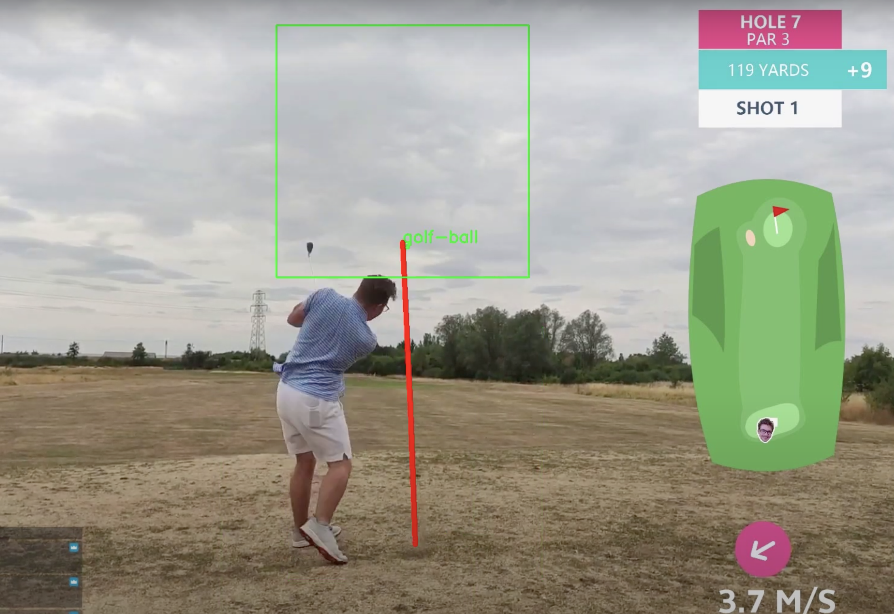

# Golf Ball AI Tracker

This is a very rough, in progress project to track a golf ball being hit.

It uses ffmpeg to grab a live video feed sent from a phone. OpenCV is then used to trim each frame down to a small region of interest (initially an assumption is made that the ball will be in the lower middle of the screen).

A custom trained YOLOv5 model is then used to detect the ball in each frame. If a ball is detected, the detection point is recorded and used as the center point of the next frame to search for the ball. This is done to reduce the search space and improve performance.

Tracked locations are stored and used to superimpose a line on the video feed to show the path of the ball. If a ball is not detected for a period of time the tracking is reset to look for the ball in the originally assumed location.

## Examples

